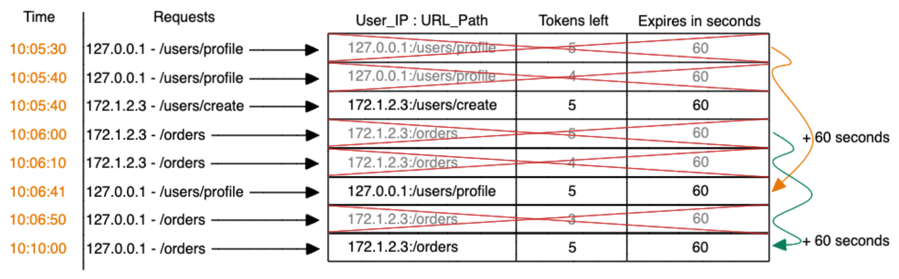

# Proxy API Challenge

## Ferramentas necessárias
- [Docker](https://www.docker.com/)
- [Docker Compose](https://docs.docker.com/compose/)
- [Node](https://nodejs.org/en/)
- [NPM](https://www.npmjs.com/)
- [MAKE](https://guialinux.uniriotec.br/make/) - **opcional**

## Inicializando o projeto
Se estiver utilizando o Make, esteja com o terminal aberto na pasta raíz do
repositório e digite `make`, e ele iniciará toda a aplicação automaticamente.

Se não estiver com o Make, basta executar os comandos abaixo
```
docker-compose up -d
npm run install
npm run start
```

## Rate Limit
O Rate limit permite limitar a quantidade de requisições enviadas para API's do
servidor. Para usuários que estão consumindo intencionalmente, evitar ataques de
Brute Force, na qual o usuário mal intencionado enviar infinitas requisições com
a intenção de sobrecarregar o serviço, ou até mesmo para evitar um escalamento
automático, prevenindo um custo operacional.

## Algoritmo adotado (Token bucket)
A aplicação salva duas informações, o `IP do usuário` e o `path da aplicação`. E
como meio de expiração, utilizamos o próprio tempo de expiração do **Redis**.
Mas havendo a necessidade de trocar a ferramenta para uma que não saiba lidar
com a expiração automática, basta acrescentar o `timestamp`.
