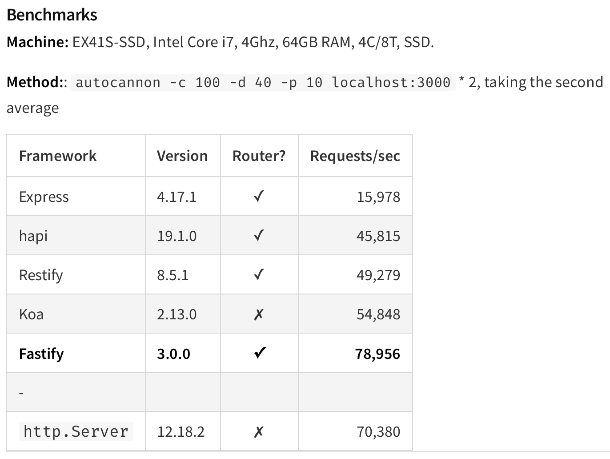
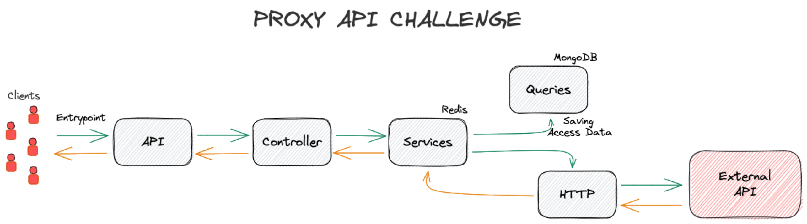

# Proxy API Challenge

Este desafio tem como objetivo o desenvolvimento de um "proxy de API" seguindo
os critérios abaixo:

- Executar a função de proxy sobre um endpoint específico, ou seja, servir de
intermediador para as requisições do cliente;
- Deverá permitir o controle das quantidades máximas de requisições por:
  - IP do cliente;
  - URL do cliente;
  - Os dois cominados;
  - A criatividade é bem vinda.
- Os dados devem ser armazenados e disponibilizados via API para coleta de
estatísticas;
- O proxy precisa ser capaz de suportar até 30k de requisições por segundo.

## 🛠 Ferramentas necessárias
- [Docker](https://www.docker.com/)
- [Docker Compose](https://docs.docker.com/compose/)
- [Node](https://nodejs.org/en/)
- [NPM](https://www.npmjs.com/)
- [MAKE](https://guialinux.uniriotec.br/make/) - **opcional**

## ✅ Inicializando o projeto
Se estiver utilizando o Make, esteja com o terminal aberto na pasta raíz do
repositório e digite `make`, assim quase todo o ambiente subirá automagicamente.

Feito isso  é necessário preencher o `.env`, para auxiliar o .env.example já
está quase totalmente preenchido. Faltando apenas o `DESTINATION_BASE_URL`, e os
demais em valor default são suficientes para execução.

Se não estiver com o Make, basta seguir o passo acima preenchendo o `.env` e
executar os comandos abaixo
```
docker-compose up -d
npm run install
npm run start
```

## 💂🏼‍♂️ Rate Limit
O Rate limit permite limitar a quantidade de requisições enviadas para API's do
servidor. Para usuários que estão consumindo intencionalmente, evitar ataques de
Brute Force, na qual o usuário mal intencionado enviar infinitas requisições com
a intenção de sobrecarregar o serviço, ou até mesmo para evitar um escalamento
automático, prevenindo um custo operacional.

### 📈 Algoritmo adotado (Token bucket)
A aplicação salva duas informações, o `IP do usuário` e o `path da aplicação`. E
como meio de expiração, utilizamos o próprio tempo de expiração do **Redis**.
Mas havendo a necessidade de trocar a ferramenta para uma que não saiba lidar
com a expiração automática, basta acrescentar o `timestamp`.


## Como suportar 50k requests por segundo
Há um benchmark feito pelos criadores do Fastify, mostrando que express.js pode
lidar com aproximadamente 15 mil requisições por segundo, e o módulo HTTP
vanilla pode lidar com 70 mil requisições por segundo.
> Fastify is a web framework highly focused on providing the best developer 
experience with the least overhead and a powerful plugin architecture. It is
inspired by Hapi and Express and as far as we know, it is one of the fastest web
frameworks in town.



## 🗃 Escolha do Banco de dados
O MongoDB provisiona uma entrega consistente e tolerante a partição **CP**. Ou
seja, quando ocorre a perda de comunicação (rede) entre dois nós quaisquer, o
sistema desativa o nó não consistente até que a partição seja resolvida.

Como o MongoDB trabalha com sistema de mestre único, cada conjunto pode ter
apenas um nó primário que receberá todas as operações gravadas. Em resumo, os
nós secundários replicam o log do nó primário e aplica ao seu próprio conjunto
de dados.

### 💁‍♂️ Cenário ideal é o AP (Availability & Partition Tolerance)
Como a aplicação trabalha com um volume massivo de requisições e seu papel
principal é fazer o controle de acessos e redirecionar o cliente para o 
endpoint-destino desejado. Logo, A base de dados não pode impactar no fluxo
intenso de requisições caso um dos nós fique indisponível.

O Cassandra por sua vez, tem uma arquitetura sem mestres. Logo, não tem mais um
único ponto de falha e sim diversos. Como não há nó principal, todos os nós
estarão disponíveis de maneira contínua.

No entanto, o Cassandra fornece funcionalidades de "reparação", recuperando o
atraso com relação aos seus pares. Em contra partida, a disponibilidade resulta
em um sistema de alto desempenho.

### ⏱ Mas por que MongoDB?
Essa entrega possui um prazo definido, como não tenho conhecimento com o
Cassandra, eu precisei me manter no MongoDB para garantir a entrega funcionando.

## 🧱 Arquitetura da aplicação
Em resumo, o app irá fornecer uma porta de entrada para API. Em seguida, é
percebido que bate no controller que chama os serviços necessários para expor
os recursos desejados pelo usuário.

Como mencionado anteriormente, o service irá armazenar alguns dados do usuário
que está acessando a API, inclusive, ele possui uma lógica para limitar as
requisições do usuário. Salvo os dados necessários é redirecionado para a camada
que cuida de recursos HTTP, ou seja, irá se comunicar com a API de destino e se
tudo ocorrer bem o retorno passa por quase todo o fluxo novamente para chegar ao
cliente final, como mostra as setas laranjas.


## 📚 Fontes:
[How many requests can hancle a real world Nodejs server](https://javascript.plainenglish.io/how-many-requests-can-handle-a-real-world-nodejs-server-side-application-55da7a2f06f3)

[Rate Limit - LogRocket](https://blog.logrocket.com/rate-limiting-node-js/)

[Rate Limit - Narendra L](https://www.youtube.com/watch?v=mhUQe4BKZXs)

[Teorema CAP](https://www.ibm.com/br-pt/cloud/learn/cap-theorem)